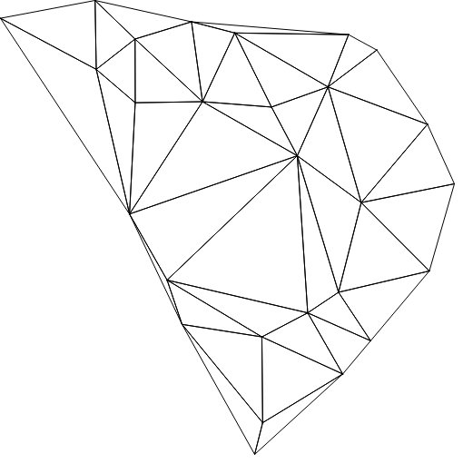

# DelaunayTriangulation
This is the final project repository of CPSC 8380 Advanced Data Structures.The goal of the project is to interpolate Weather data in South Carolina using Delaunay Triangulation and Voronoi Diagram dual using two algorithms: Dwyer's Divide and conquer and Bowyer-Watson's Incremental algorithm.

## Dependencies
- numpy
- scipy
- pygame
- libpysal
- other requirements are list in requirements.yaml

# Result: Bowyer-Watson

